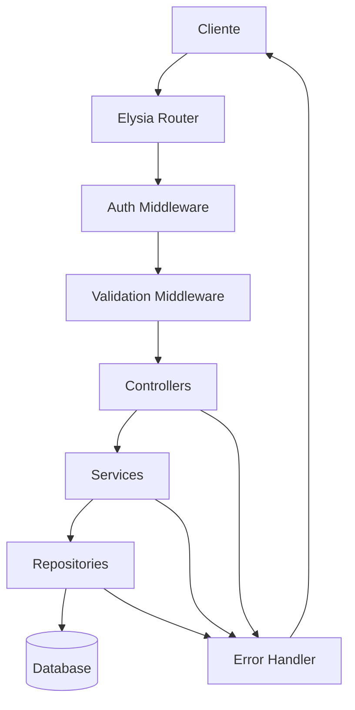

# Design Document

## Overview

Esta API REST será construída usando Bun como runtime JavaScript e Elysia como framework web. A arquitetura seguirá princípios de Clean Architecture com separação clara de responsabilidades, usando padrão de repositório para acesso aos dados, middleware para autenticação JWT, validação com TypeBox e tratamento centralizado de erros.

## Architecture

### High-Level Architecture



### Directory Structure

```
src/
├── controllers/          # Controladores HTTP
├── services/            # Lógica de negócio
├── repositories/        # Acesso aos dados
├── middleware/          # Middlewares (auth, validation, error)
├── schemas/            # Schemas TypeBox para validação
├── types/              # Definições de tipos TypeScript
├── utils/              # Utilitários (JWT, hash, etc.)
├── config/             # Configurações da aplicação
└── app.ts              # Configuração principal do Elysia
```

## Components and Interfaces

### Core Entities

#### User
```typescript
interface User {
  id: string;
  email: string;
  name: string;
  password: string; // hashed
  role: 'admin' | 'manager' | 'developer';
  createdAt: Date;
  updatedAt: Date;
}
```

#### Project
```typescript
interface Project {
  id: string;
  name: string;
  description: string;
  ownerId: string;
  status: 'active' | 'archived' | 'completed';
  createdAt: Date;
  updatedAt: Date;
}
```

#### WorkItem
```typescript
interface WorkItem {
  id: string;
  title: string;
  description: string;
  type: 'task' | 'bug' | 'story';
  status: 'todo' | 'in_progress' | 'done';
  priority: 'low' | 'medium' | 'high' | 'critical';
  projectId: string;
  assigneeId?: string;
  reporterId: string;
  storyPoints?: number;
  estimatedHours?: number;
  createdAt: Date;
  updatedAt: Date;
}
```

#### Sprint
```typescript
interface Sprint {
  id: string;
  name: string;
  projectId: string;
  startDate: Date;
  endDate: Date;
  status: 'planned' | 'active' | 'completed';
  goal?: string;
  createdAt: Date;
  updatedAt: Date;
}
```

### Repository Interfaces

#### IUserRepository
```typescript
interface IUserRepository {
  create(user: Omit<User, 'id' | 'createdAt' | 'updatedAt'>): Promise<User>;
  findById(id: string): Promise<User | null>;
  findByEmail(email: string): Promise<User | null>;
  update(id: string, data: Partial<User>): Promise<User>;
  delete(id: string): Promise<void>;
  list(): Promise<User[]>;
}
```

#### IProjectRepository
```typescript
interface IProjectRepository {
  create(project: Omit<Project, 'id' | 'createdAt' | 'updatedAt'>): Promise<Project>;
  findById(id: string): Promise<Project | null>;
  findByUserId(userId: string): Promise<Project[]>;
  update(id: string, data: Partial<Project>): Promise<Project>;
  delete(id: string): Promise<void>;
  list(): Promise<Project[]>;
}
```

#### IWorkItemRepository
```typescript
interface IWorkItemRepository {
  create(item: Omit<WorkItem, 'id' | 'createdAt' | 'updatedAt'>): Promise<WorkItem>;
  findById(id: string): Promise<WorkItem | null>;
  findByProjectId(projectId: string): Promise<WorkItem[]>;
  findByAssigneeId(assigneeId: string): Promise<WorkItem[]>;
  update(id: string, data: Partial<WorkItem>): Promise<WorkItem>;
  delete(id: string): Promise<void>;
  findByStatus(projectId: string, status: string): Promise<WorkItem[]>;
  updatePriority(id: string, priority: number): Promise<WorkItem>;
}
```

### Service Layer

#### AuthService
```typescript
interface IAuthService {
  login(email: string, password: string): Promise<{ user: User; token: string }>;
  register(userData: RegisterData): Promise<User>;
  verifyToken(token: string): Promise<User>;
  hashPassword(password: string): Promise<string>;
  comparePassword(password: string, hash: string): Promise<boolean>;
}
```

#### ProjectService
```typescript
interface IProjectService {
  createProject(data: CreateProjectData, userId: string): Promise<Project>;
  getProject(id: string, userId: string): Promise<Project>;
  updateProject(id: string, data: UpdateProjectData, userId: string): Promise<Project>;
  deleteProject(id: string, userId: string): Promise<void>;
  listUserProjects(userId: string): Promise<Project[]>;
}
```

#### WorkItemService
```typescript
interface IWorkItemService {
  createWorkItem(data: CreateWorkItemData, userId: string): Promise<WorkItem>;
  getWorkItem(id: string, userId: string): Promise<WorkItem>;
  updateWorkItem(id: string, data: UpdateWorkItemData, userId: string): Promise<WorkItem>;
  deleteWorkItem(id: string, userId: string): Promise<void>;
  getProjectWorkItems(projectId: string, userId: string): Promise<WorkItem[]>;
  getKanbanBoard(projectId: string, userId: string): Promise<KanbanBoard>;
  updateWorkItemStatus(id: string, status: string, userId: string): Promise<WorkItem>;
  getBacklog(projectId: string, userId: string): Promise<WorkItem[]>;
  updatePriority(id: string, priority: number, userId: string): Promise<WorkItem>;
}
```

### API Endpoints

#### Authentication Routes
- `POST /auth/login` - Login do usuário
- `POST /auth/register` - Registro de novo usuário
- `POST /auth/refresh` - Renovar token JWT

#### Project Routes
- `GET /projects` - Listar projetos do usuário
- `POST /projects` - Criar novo projeto
- `GET /projects/:id` - Obter projeto específico
- `PUT /projects/:id` - Atualizar projeto
- `DELETE /projects/:id` - Deletar projeto

#### Work Item Routes
- `GET /projects/:projectId/items` - Listar itens do projeto
- `POST /projects/:projectId/items` - Criar novo item
- `GET /items/:id` - Obter item específico
- `PUT /items/:id` - Atualizar item
- `DELETE /items/:id` - Deletar item
- `PATCH /items/:id/status` - Atualizar status do item

#### Board Routes
- `GET /projects/:projectId/kanban` - Obter quadro Kanban
- `GET /projects/:projectId/backlog` - Obter backlog
- `PATCH /items/:id/priority` - Atualizar prioridade

## Data Models

### Database Schema (usando SQLite para simplicidade)

#### Users Table
```sql
CREATE TABLE users (
  id TEXT PRIMARY KEY,
  email TEXT UNIQUE NOT NULL,
  name TEXT NOT NULL,
  password TEXT NOT NULL,
  role TEXT CHECK(role IN ('admin', 'manager', 'developer')) NOT NULL,
  created_at DATETIME DEFAULT CURRENT_TIMESTAMP,
  updated_at DATETIME DEFAULT CURRENT_TIMESTAMP
);
```

#### Projects Table
```sql
CREATE TABLE projects (
  id TEXT PRIMARY KEY,
  name TEXT NOT NULL,
  description TEXT,
  owner_id TEXT NOT NULL,
  status TEXT CHECK(status IN ('active', 'archived', 'completed')) DEFAULT 'active',
  created_at DATETIME DEFAULT CURRENT_TIMESTAMP,
  updated_at DATETIME DEFAULT CURRENT_TIMESTAMP,
  FOREIGN KEY (owner_id) REFERENCES users(id)
);
```

#### Work Items Table
```sql
CREATE TABLE work_items (
  id TEXT PRIMARY KEY,
  title TEXT NOT NULL,
  description TEXT,
  type TEXT CHECK(type IN ('task', 'bug', 'story')) NOT NULL,
  status TEXT CHECK(status IN ('todo', 'in_progress', 'done')) DEFAULT 'todo',
  priority TEXT CHECK(priority IN ('low', 'medium', 'high', 'critical')) DEFAULT 'medium',
  project_id TEXT NOT NULL,
  assignee_id TEXT,
  reporter_id TEXT NOT NULL,
  story_points INTEGER,
  estimated_hours INTEGER,
  priority_order INTEGER DEFAULT 0,
  created_at DATETIME DEFAULT CURRENT_TIMESTAMP,
  updated_at DATETIME DEFAULT CURRENT_TIMESTAMP,
  FOREIGN KEY (project_id) REFERENCES projects(id),
  FOREIGN KEY (assignee_id) REFERENCES users(id),
  FOREIGN KEY (reporter_id) REFERENCES users(id)
);
```

### TypeBox Validation Schemas

#### User Schemas
```typescript
const CreateUserSchema = Type.Object({
  email: Type.String({ format: 'email' }),
  name: Type.String({ minLength: 2, maxLength: 100 }),
  password: Type.String({ minLength: 8 }),
  role: Type.Union([Type.Literal('admin'), Type.Literal('manager'), Type.Literal('developer')])
});

const LoginSchema = Type.Object({
  email: Type.String({ format: 'email' }),
  password: Type.String({ minLength: 1 })
});
```

#### Project Schemas
```typescript
const CreateProjectSchema = Type.Object({
  name: Type.String({ minLength: 1, maxLength: 200 }),
  description: Type.Optional(Type.String({ maxLength: 1000 }))
});

const UpdateProjectSchema = Type.Object({
  name: Type.Optional(Type.String({ minLength: 1, maxLength: 200 })),
  description: Type.Optional(Type.String({ maxLength: 1000 })),
  status: Type.Optional(Type.Union([
    Type.Literal('active'),
    Type.Literal('archived'),
    Type.Literal('completed')
  ]))
});
```

#### Work Item Schemas
```typescript
const CreateWorkItemSchema = Type.Object({
  title: Type.String({ minLength: 1, maxLength: 200 }),
  description: Type.Optional(Type.String({ maxLength: 2000 })),
  type: Type.Union([Type.Literal('task'), Type.Literal('bug'), Type.Literal('story')]),
  assigneeId: Type.Optional(Type.String()),
  storyPoints: Type.Optional(Type.Integer({ minimum: 1, maximum: 100 })),
  estimatedHours: Type.Optional(Type.Integer({ minimum: 1, maximum: 1000 }))
});
```

## Error Handling

### Error Types
```typescript
class AppError extends Error {
  constructor(
    public message: string,
    public statusCode: number,
    public code: string
  ) {
    super(message);
  }
}

class ValidationError extends AppError {
  constructor(message: string, public details: any) {
    super(message, 400, 'VALIDATION_ERROR');
  }
}

class NotFoundError extends AppError {
  constructor(resource: string) {
    super(`${resource} not found`, 404, 'NOT_FOUND');
  }
}

class UnauthorizedError extends AppError {
  constructor(message = 'Unauthorized') {
    super(message, 401, 'UNAUTHORIZED');
  }
}

class ForbiddenError extends AppError {
  constructor(message = 'Forbidden') {
    super(message, 403, 'FORBIDDEN');
  }
}
```

### Global Error Handler
```typescript
const errorHandler = (error: Error) => {
  if (error instanceof AppError) {
    return new Response(
      JSON.stringify({
        error: {
          code: error.code,
          message: error.message,
          ...(error instanceof ValidationError && { details: error.details })
        }
      }),
      {
        status: error.statusCode,
        headers: { 'Content-Type': 'application/json' }
      }
    );
  }

  // Log unexpected errors
  console.error('Unexpected error:', error);
  
  return new Response(
    JSON.stringify({
      error: {
        code: 'INTERNAL_ERROR',
        message: 'Internal server error'
      }
    }),
    {
      status: 500,
      headers: { 'Content-Type': 'application/json' }
    }
  );
};
```

## Testing Strategy

### Unit Tests
- **Repository Tests**: Testar operações CRUD isoladamente
- **Service Tests**: Testar lógica de negócio com mocks dos repositories
- **Utility Tests**: Testar funções de hash, JWT, validação

### Integration Tests
- **API Endpoint Tests**: Testar rotas completas com banco de dados em memória
- **Authentication Flow Tests**: Testar login, registro e middleware de auth
- **Business Logic Tests**: Testar fluxos completos como criação de projeto com itens

### Test Structure
```typescript
// Exemplo de teste de repository
describe('UserRepository', () => {
  let repository: IUserRepository;
  
  beforeEach(() => {
    // Setup in-memory database
    repository = new UserRepository(testDb);
  });
  
  it('should create user successfully', async () => {
    const userData = { email: 'test@test.com', name: 'Test', password: 'hashed', role: 'developer' };
    const user = await repository.create(userData);
    
    expect(user.id).toBeDefined();
    expect(user.email).toBe(userData.email);
  });
});

// Exemplo de teste de API
describe('POST /projects', () => {
  it('should create project when authenticated', async () => {
    const token = await getAuthToken();
    const response = await app.handle(
      new Request('http://localhost/projects', {
        method: 'POST',
        headers: {
          'Authorization': `Bearer ${token}`,
          'Content-Type': 'application/json'
        },
        body: JSON.stringify({ name: 'Test Project', description: 'Test' })
      })
    );
    
    expect(response.status).toBe(201);
    const project = await response.json();
    expect(project.name).toBe('Test Project');
  });
});
```

### Test Tools
- **Bun Test**: Framework de teste nativo do Bun
- **SQLite in-memory**: Para testes de integração
- **JWT Test Utils**: Para gerar tokens de teste
- **Mock Factories**: Para criar dados de teste consistentes