# Design Document

## Overview

Este documento descreve o design para corrigir os 34 testes falhando na API de gerenciamento de projetos. A solução aborda problemas de serialização, validação, autorização, queries de banco de dados e configuração de testes.

## Architecture

### Componentes Afetados

1. **Repositories Layer**: Correção de serialização de datas e queries SQL
2. **Services Layer**: Implementação de validações de negócio
3. **Middleware Layer**: Correção de validações de entrada
4. **Test Infrastructure**: Configuração adequada de testes

### Fluxo de Correções

```mermaid
graph TD
    A[Database Layer] --> B[Repository Layer]
    B --> C[Service Layer]
    C --> D[Controller Layer]
    D --> E[Middleware Layer]
    E --> F[Test Layer]
    
    B --> G[Date Serialization Fix]
    C --> H[Business Logic Validation]
    D --> I[Authorization Fix]
    E --> J[Input Validation]
    F --> K[Test Configuration]
```



## Components and Interfaces

### 1. Repository Layer Fixes

#### Date Serialization
- **Problem**: SQLite retorna datas como strings ISO
- **Solution**: Converter strings para objetos Date nos repositórios
- **Implementation**: Adicionar método `parseDate()` para conversão

#### Query Corrections
- **Problem**: Queries SQL incorretas ou incompletas
- **Solution**: Revisar e corrigir queries específicas
- **Areas**: findByUserId, isOwner, findWithFilters, joins

### 2. Service Layer Fixes

#### Status Transition Validation
- **Problem**: Transições inválidas não são bloqueadas
- **Solution**: Implementar matriz de transições válidas
- **Rules**: 
  - done → todo: INVALID
  - todo → in_progress → done: VALID
  - in_progress → todo: VALID

#### Authorization Logic
- **Problem**: Verificação de propriedade falhando
- **Solution**: Corrigir lógica de verificação de acesso

### 3. Middleware Layer Fixes

#### Input Validation
- **Problem**: Validações não rejeitam dados inválidos
- **Solution**: Revisar schemas de validação Zod
- **Focus**: Campos obrigatórios, limites de tamanho, tipos

#### Error Handling
- **Problem**: Códigos de erro inconsistentes
- **Solution**: Padronizar retorno de erros HTTP

### 4. Test Infrastructure Fixes

#### HTTP Headers
- **Problem**: Headers com caracteres Unicode inválidos
- **Solution**: Usar apenas headers ASCII válidos

#### Test Data Isolation
- **Problem**: Dados de teste interferindo entre si
- **Solution**: Melhorar limpeza de dados entre testes

## Data Models

### Date Handling Strategy

```typescript
interface DateConversion {
  parseDate(value: string | Date): Date;
  serializeDate(date: Date): string;
}

// Repository implementation
class BaseRepository {
  protected parseDate(value: string | Date): Date {
    return typeof value === 'string' ? new Date(value) : value;
  }
}
```

### Status Transition Matrix

```typescript
const VALID_TRANSITIONS: Record<WorkItemStatus, WorkItemStatus[]> = {
  'todo': ['in_progress'],
  'in_progress': ['todo', 'done'],
  'done': ['in_progress'] // Cannot go back to todo
};
```

## Error Handling

### Error Code Standardization

| Scenario | Expected Code | Current Issue |
|----------|---------------|---------------|
| Validation Error | 422 | Sometimes 201 |
| Invalid Transition | 400 | Sometimes 200 |
| Unauthorized | 401 | Working |
| Forbidden | 403 | Working |
| Not Found | 404 | Working |

### Error Response Format

```typescript
interface ErrorResponse {
  success: false;
  message: string;
  errors?: ValidationError[];
}
```

## Testing Strategy

### Test Categories to Fix

1. **Repository Tests**: 21 failures
   - Date serialization issues
   - Query result mismatches
   - Join operation problems

2. **Integration Tests**: 10 failures
   - Authorization scenarios
   - Error handling
   - HTTP protocol issues

3. **Service Tests**: 3 failures
   - Token generation
   - Status transitions
   - Business logic validation

### Test Data Management

- Implement proper test data factories
- Ensure data isolation between tests
- Use consistent test user/project IDs

### Mock Strategy

- Mock external dependencies consistently
- Ensure mocks return expected data types
- Validate mock call parameters

## Implementation Priority

### Phase 1: Critical Fixes (High Impact)
1. Date serialization in repositories
2. Authorization logic corrections
3. Status transition validation

### Phase 2: Validation Fixes (Medium Impact)
1. Input validation schemas
2. Error code standardization
3. HTTP method handling

### Phase 3: Test Infrastructure (Low Impact)
1. Test configuration cleanup
2. Header validation fixes
3. Test data isolation improvements

## Validation Approach

### Pre-Implementation Validation
- Review each failing test case
- Identify root cause category
- Plan specific fix approach

### Post-Implementation Validation
- Run full test suite
- Verify no regressions
- Check error message consistency

## Dependencies

### External Dependencies
- SQLite database behavior
- Zod validation library
- JWT token generation
- Elysia framework error handling

### Internal Dependencies
- Repository base classes
- Service layer interfaces
- Middleware chain order
- Test setup utilities